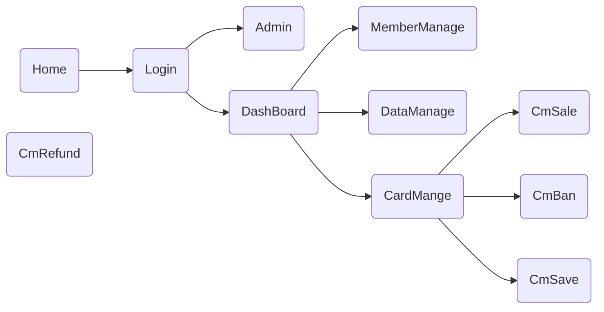

# NMMS_front

> The front for Natatorium Member Manage System
> 游泳馆会员管理系统界面

## Build Setup

``` bash
# install dependencies
cnpm install

# serve with hot reload at http://127.0.0.1:8808
npm run dev

# build for production with minification
npm run build

# build for production and view the bundle analyzer report
npm run build --report
```

### 一个会员制的游泳馆希望通过计算机实现会员管理。系统主要功能如下

- 售卡管理：销售会员卡时要输入卡号、金额、折扣、类型（储值卡、折扣卡）以及持卡人基本资料（姓名、电话、证件号等）等信息，这些信息记录到会员资料中。
- 会员资料管理：查询和修改会员资料（其中卡号和金额不能修改）。可按照卡号、持卡人姓名查询信息。
- 存款管理：如果会员卡类别是储值卡，可根据卡号进行预存款操作。
- 退卡管理：执行退卡操作后该卡不可再使用，但保留该卡以前的消费记录。
- 会员禁用：用来挂失或是停止会员卡的使用（记录禁用的原因），实现对会员卡的安全管理可以通过解禁功能恢复会员卡的正常使用。
- 消费管理：记录会员的消费情况，可以查看会员的消费金额，存款金额、结存余额，可以查询任何一段时间内该卡的消费情况，也可以查询所有会员卡的汇总记录。
- 系统管理：包括参数设置、权限设置、更改密码等。

### Function Split

AppFunc--
​		|--Home 管理系统主页
​		|--Login 登录|注册|找回密码界面
​		|--Admin sys管理员控制台界面，包括参数设置、权限设置、更改密码等
​		|--DashBoard 仪表盘，各种管理模块的接口
​			|--MemberManage 用户管理界面，能够查看用户列表，编辑用户基本信息，查看用户相关卡号并跳转到相关会员卡管理界面
​			|--DataManage 消费管理入口，显示当天/周/月/总游泳馆进出帐情况，跳转汇总记录界面，实现消费管理的功能
​			|--CardManage 会员卡管理入口，跳转售卡界面，会员卡禁用界面（挂失和禁用），退卡管理界面，存款管理界面
​				|--CmSale 售卡界面
​				|--CmBan 禁用界面
​				|--CmSave 存款界面

### 界面布局


​                                    


- 查询和修改会员资料